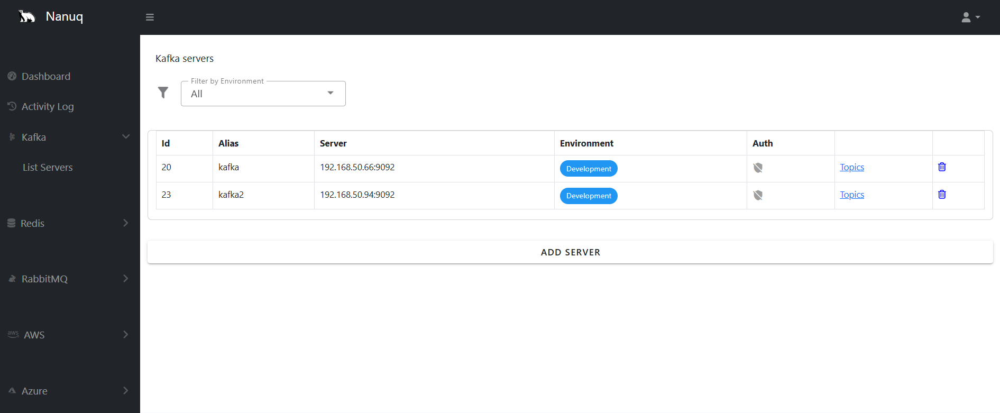
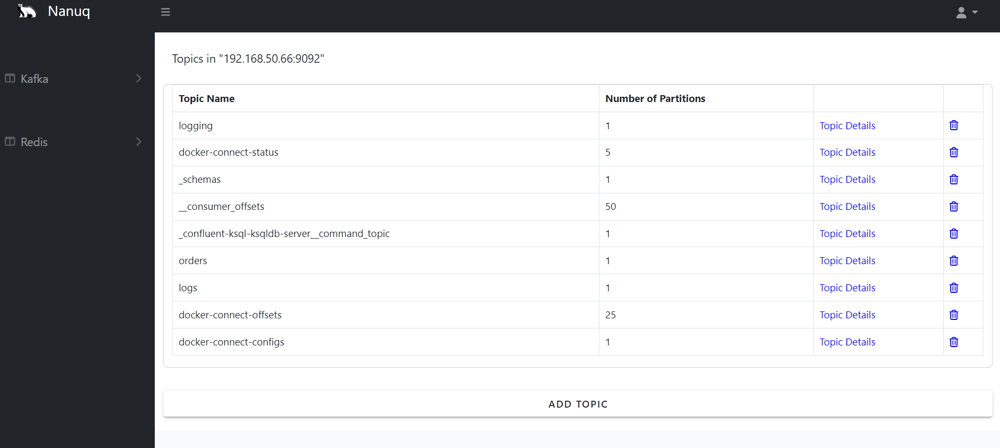
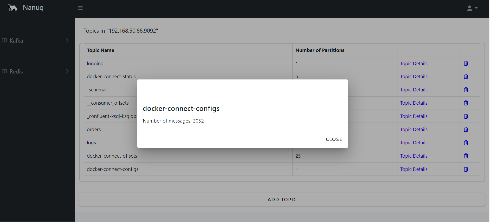
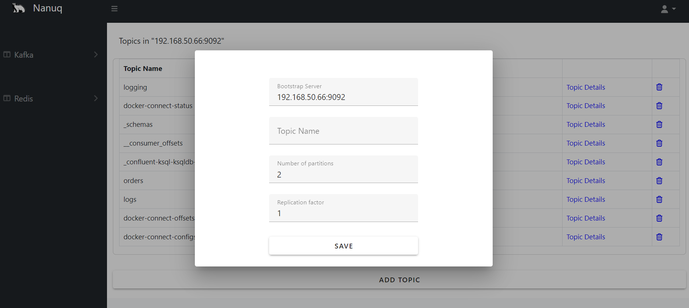

    

# Nanuq

## About

Nanuq is an open-source application designed to simplify the management of Kafka, and Redis for developers. Instead of relying on command-line interfaces for each server, Nanuq provides a unified, user-friendly interface that streamlines daily tasks. Whether you're monitoring queues, managing datasets, or configuring clusters, Nanuq empowers you to handle these critical operations with ease, all from a single UI.

Built with a focus on usability and efficiency, Nanuq aims to reduce the overhead associated with managing these powerful technologies, allowing developers to focus on building and deploying applications rather than managing infrastructure.

## Feature list

### Kafka

- Display server's topics
- Display how many items in each topic
- Add topic

### Redis

- Display Server's details
- Display databases
- Display all string cached keys
- Add item to cache
- Invalidate cache

## Screenshot

### Kafka

### Redis

## Installation

### Clone

### Docker compose

### Kubernetes deploy

## Disclaimer

Nanuq is currently intended for use in local development and DEV environments only. While we strive to provide a reliable tool for managing Kafka and Redis, this application is not yet ready for production environments. Users should exercise caution and thoroughly test Nanuq in non-production settings before considering any production use. We are continuously working on improvements and welcome contributions from the community to help make Nanuq production-ready in the future.

---

