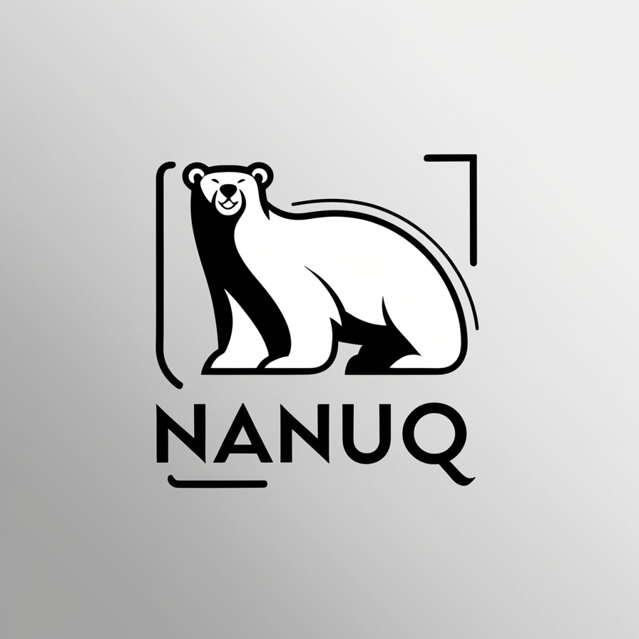

    

# Nanuq

## To-do
- ✅ Store connection in Sqlite database
- All-in-one docker compose
- k8s deploy 
- Connect to the following
  - Kafka
    - ✅ Show topics
    - ✅ How many items in each topic
    - ✅ Add Topic
    - Real time
  - RabbitMQ
    - Topic
    - Exchange
    - How many item in each topic
- Redis
    - Databases
    - Sizes
    - Invalidate?
- Built-in
  - Logs
  - ELK stack
  - OpenTelemetry
- ✅ Aspire
