<p align="center">
    
</p>


# Nanuq
[](https://github.com/waelouf/Nanuq/actions/workflows/dotnet.yml)
[](https://github.com/waelouf/Nanuq/actions/workflows/vue-app.yml)

## About

Nanuq **Version 2.0** is an open-source unified management platform for five critical messaging and caching systems: **Kafka**, **Redis**, **RabbitMQ**, **AWS** (SQS/SNS), and **Azure Service Bus**. Designed for developers working across local, development, staging, and production environments, Nanuq eliminates the complexity of managing multiple command-line interfaces by providing a single, intuitive UI for all platforms.

With **enterprise-grade security** featuring AES-256 encrypted credential storage, real-time monitoring dashboards, comprehensive activity tracking, and advanced data type support, Nanuq empowers developers to manage critical infrastructure operations with confidence—all from one unified interface. Focus on building applications, not managing infrastructure.

## What's New in Version 2.0

Nanuq 2.0 represents a major milestone with enterprise-grade features and expanded cloud platform support:

- **☁️ Cloud Platform Integration** - Complete AWS (SQS/SNS) and Azure Service Bus support with multi-region deployment across 15 AWS and 30+ Azure regions
- **🔒 Enterprise Security** - AES-256 encrypted credential storage with DPAPI key derivation, secure credential management API, and automatic credential detection
- **📊 Unified Dashboard** - Real-time metrics and monitoring across all 5 platforms (Kafka, Redis, RabbitMQ, AWS, Azure) with environment breakdown and health indicators
- **📝 Activity Tracking & Audit** - Complete audit trail with 24+ activity types, advanced filtering, date range selection, and CSV/JSON export capabilities
- **🏢 Multi-Environment Management** - Built-in support for Development, Staging, and Production environments with color-coded badges and filtering
- **💾 Advanced Redis Support** - Full CRUD operations for 6 data types: Strings, Lists, Hashes, Sets, Sorted Sets, and Streams with pagination
- **✨ Production Ready** - Comprehensive error handling, pagination support, retry logic, loading states, and user-friendly error messages

## Feature list

### Dashboard

- **Unified Dashboard** - Single view for all platforms (Kafka, Redis, RabbitMQ, AWS, Azure)
- **Real-time Metrics** - Server count, topic count, queue count, resource count
- **Environment Breakdown** - Visual breakdown by Development, Staging, Production
- **Activity Log Widget** - Recent activity tracking with relative timestamps
- **Quick Actions** - Shortcuts to add servers for each platform
- **Individual Refresh** - Refresh metrics per platform independently

### Authentication & Security

- **Encrypted Credential Storage** - AES-256 encryption for all stored credentials
- **Database Migrations** - DbUp-based SQL migrations for schema management
- **Credential Management API** - Full CRUD operations for server credentials
- **Connection Testing** - Test Kafka/Redis/RabbitMQ connections before saving credentials
- **Secure Storage** - Passwords never exposed in API responses, only metadata

### Kafka

- Display server's topics
- Display how many items in each topic
- Add topic
- **Authentication Support** - SASL/PLAIN authentication for secured Kafka clusters
- **Credential Management** - Store and manage Kafka server credentials securely

### Redis

- Display Server's details
- Display databases
- **Advanced Data Types Support**
  - **Strings** - View, add, and invalidate cached keys
  - **Lists** - Push/pop elements, view all elements, manage list keys
  - **Hashes** - Set/get fields, view all fields, manage hash keys
  - **Sets** - Add/remove members, view set members, manage set keys
  - **Sorted Sets** - Add members with scores, view sorted members, manage sorted set keys
  - **Streams** - Add entries with multiple fields, view stream entries, manage stream keys
- **Authentication Support** - Password and ACL (Redis 6+) authentication
- **Credential Management** - Store and manage Redis server credentials securely

### RabbitMQ

- Display server's exchanges and queues
- Create and delete exchanges (multiple types: direct, fanout, topic, headers)
- Create and delete queues with configuration options
- View queue details (message count, consumers, state)
- **Authentication Support** - Username and password authentication for RabbitMQ Management API
- **Credential Management** - Store and manage RabbitMQ server credentials securely

### AWS (SQS/SNS)

- **SQS Management**
  - List all SQS queues
  - Create standard and FIFO queues with custom configuration
  - Send messages to queues
  - Receive and delete messages
  - View queue details and attributes
- **SNS Management**
  - List all SNS topics
  - Create and delete topics
  - Publish messages to topics
  - Manage subscriptions (HTTP, HTTPS, Email, SMS, SQS, Lambda)
  - View topic details and subscriptions
- **Multi-Region Support** - 15 AWS regions supported
- **Credential Management** - AES-256 encrypted AWS Access Key and Secret Key storage
- **Environment Tagging** - Development, Staging, Production support

### Azure (Service Bus)

- **Queue Management**
  - List all Azure Service Bus queues
  - Create and delete queues with configurable properties
  - Send messages to queues with custom content type and application properties
  - Receive messages from queues (peek-lock mode)
  - View queue details (message count, dead-letter count, lock duration, TTL settings)
  - Configurable options: Max size, delivery count, duplicate detection, sessions, dead-lettering
- **Topic Management**
  - List all Azure Service Bus topics
  - Create and delete topics with configurable properties
  - Publish messages to topics with custom content type and application properties
  - View topic details (subscription count, max size, TTL settings)
  - Configurable options: Max size, duplicate detection, support ordering
- **Subscription Management**
  - List subscriptions for a topic
  - Create and delete subscriptions
  - Configurable options: Max delivery count, lock duration, sessions, dead-lettering
- **Multi-Region Support** - 30+ Azure regions supported (East US, West US, West Europe, Southeast Asia, etc.)
- **Credential Management** - AES-256 encrypted Azure Service Bus connection strings
- **Environment Tagging** - Development, Staging, Production support
- **Service Type Tracking** - Differentiates between ServiceBus and future Azure services

### Activity Log

- **Complete Activity Tracking** - All server and resource operations logged
- **24 Activity Types** - Covers all platforms (Kafka, Redis, RabbitMQ, AWS, Azure)
- **Filtering & Search** - Filter by type, date range, and search text
- **Export Functionality** - Export to CSV or JSON
- **Visual Timeline** - Color-coded activity chips with Material Design icons
- **Real-time Updates** - Refresh to see latest activities

## Screenshot

### Dashboard

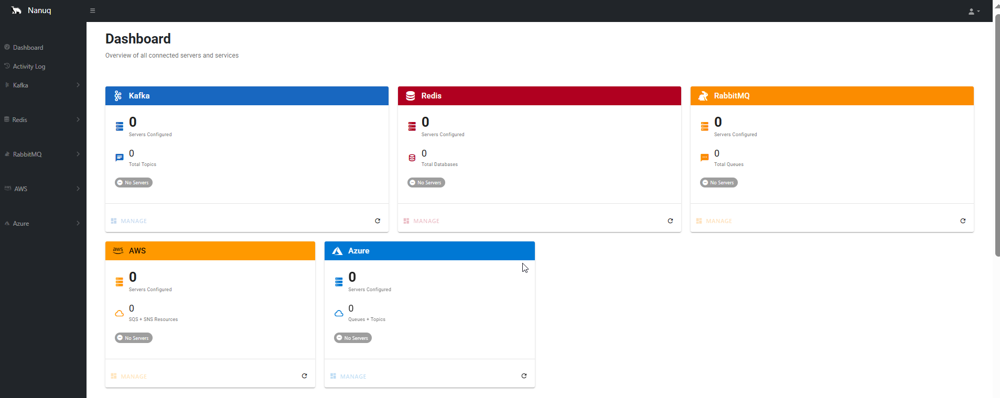
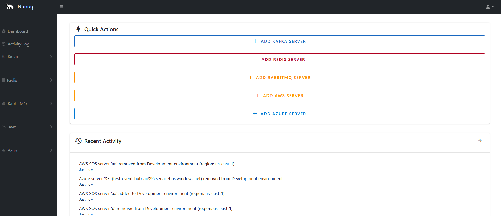

### Activity Logs

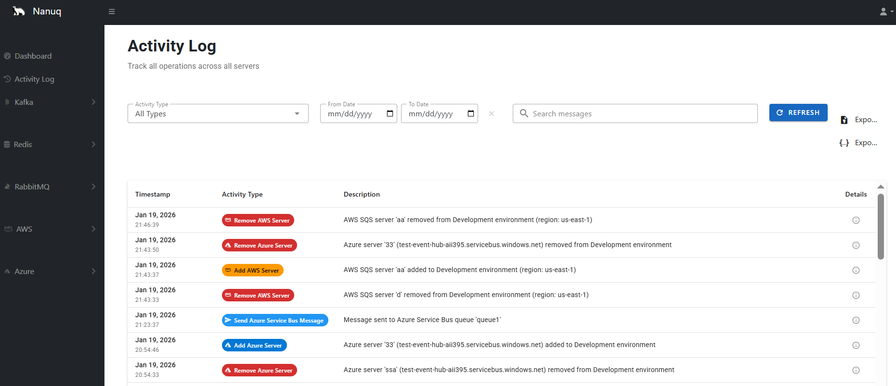

### Kafka


### Redis


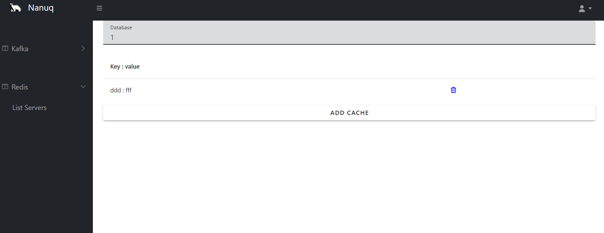
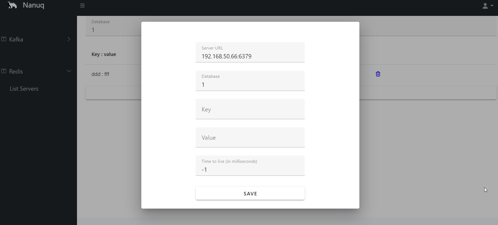

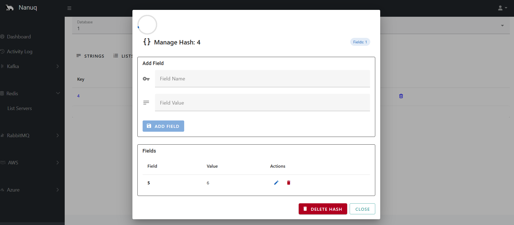

### RabbitMQ

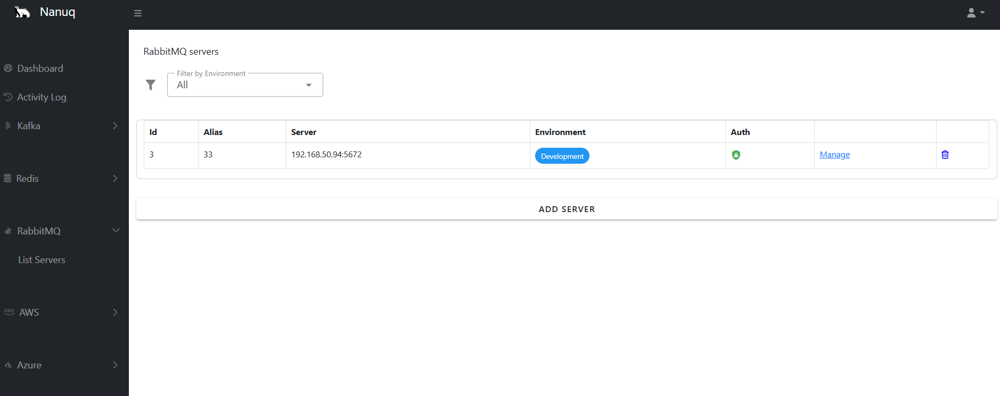
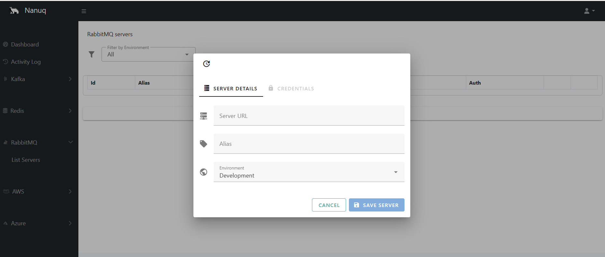
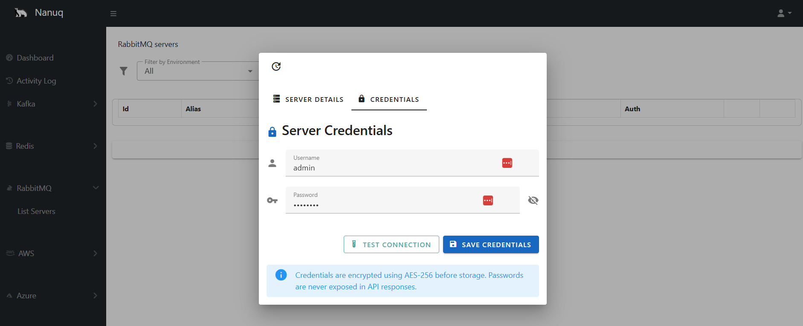
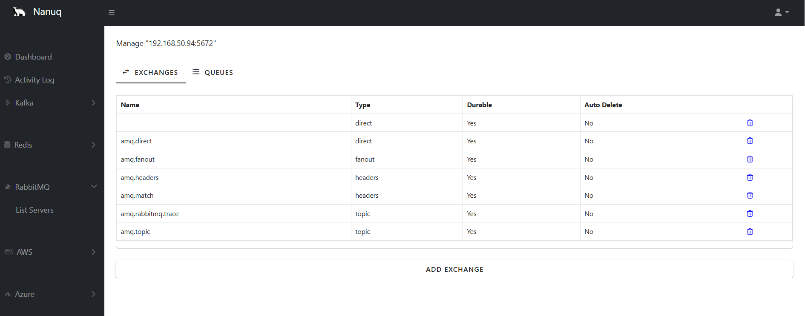
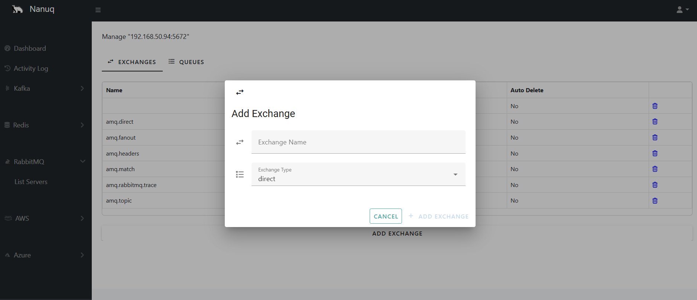


### AWS (SQS/SNS)

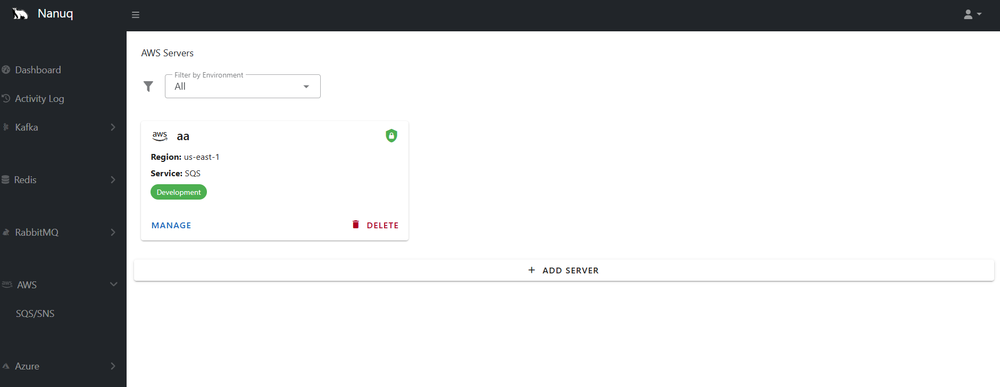
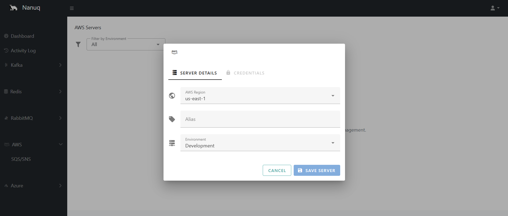
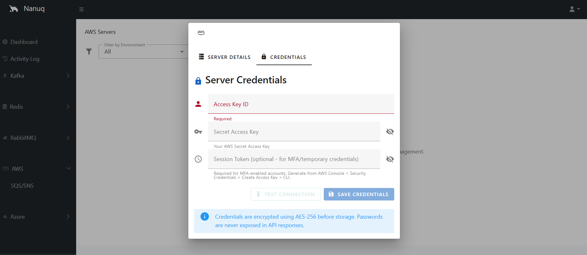
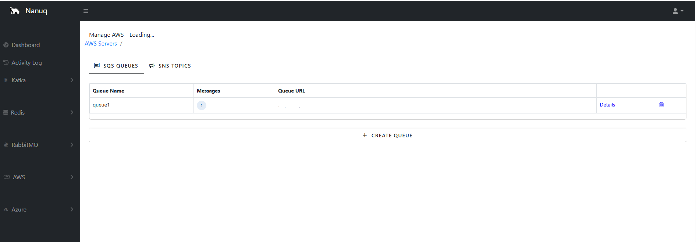
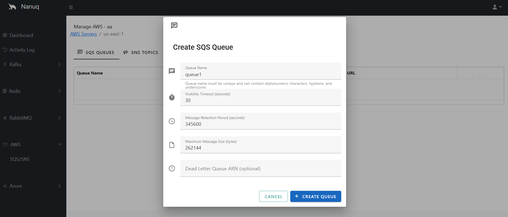
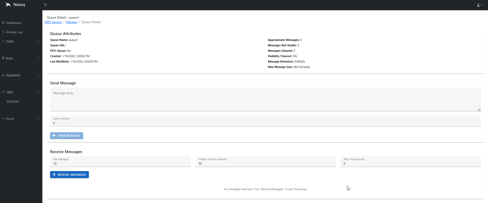
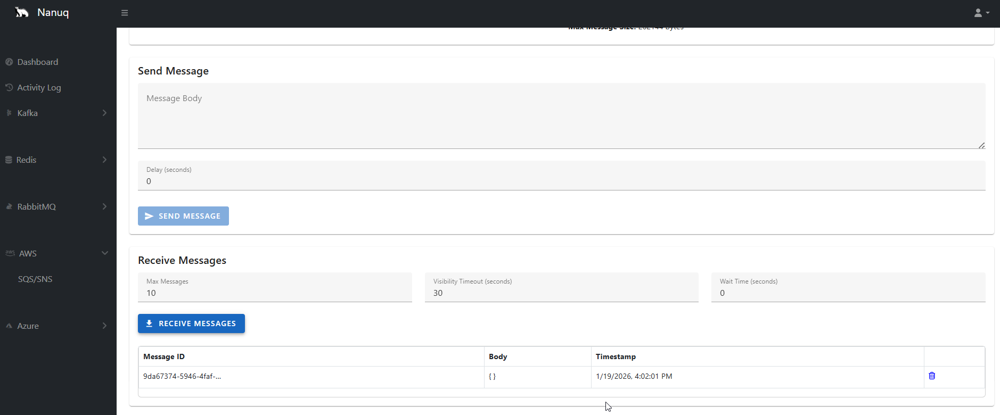

### Azure Service Bus

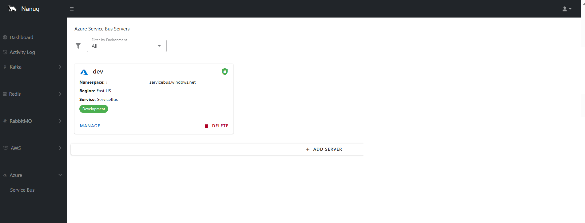
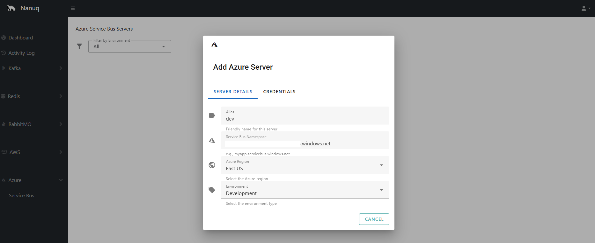
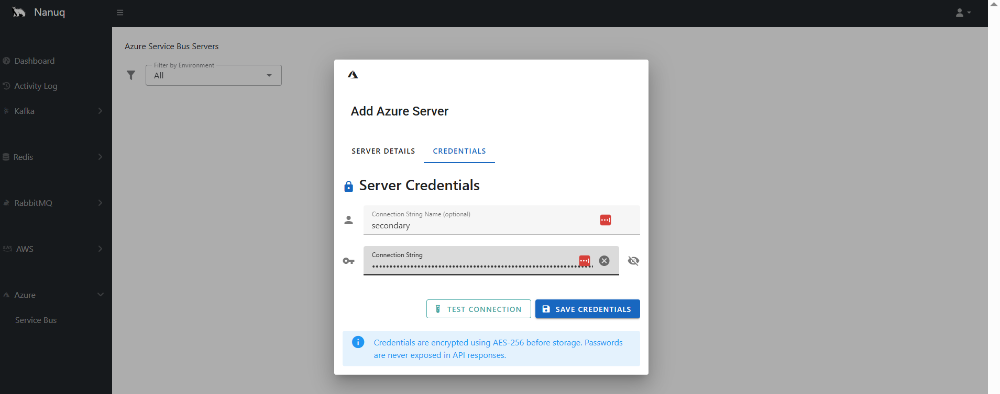
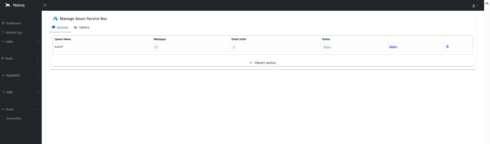
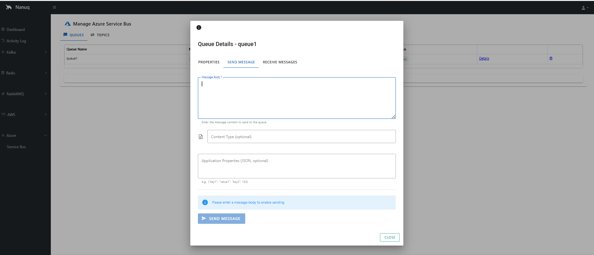
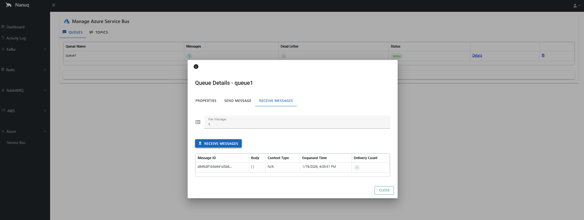

## Installation

### Clone

```powershell
git clone git@github.com:waelouf/Nanuq.git

# To run backend
cd .\src\services\Nanuq\Nanuq.WebApi\

dotnet run

# To run frontend

cd .\src\app\nanuq-app\
npm i
npm run serve
```


### Docker compose

```powershell
cd .\Docker\
docker-compose up -d
```

### Kubernetes deploy

```powershell
cd .\K8s

kubectl apply -f api-server.yaml
kubectl apply -f nanuq-app.yaml

```

Or using All in one without clone
```powershell

kubectl apply -f https://raw.githubusercontent.com/waelouf/Nanuq/refs/heads/main/K8s/nanuq-all-in-one.yaml

```
