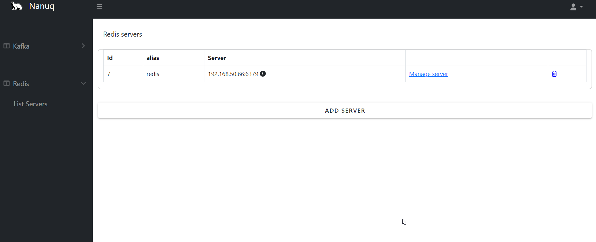

<p align="center">
    
</p>


# Nanuq
[](https://github.com/waelouf/Nanuq/actions/workflows/dotnet.yml)
[](https://github.com/waelouf/Nanuq/actions/workflows/vue-app.yml)

## About

Nanuq is an open-source application designed to simplify the management of Kafka, Redis, RabbitMQ, AWS services (SQS/SNS), and Azure Service Bus for developers. Instead of relying on command-line interfaces for each server, Nanuq provides a unified, user-friendly interface that streamlines daily tasks. Whether you're monitoring queues, managing datasets, configuring clusters, or managing cloud messaging services, Nanuq empowers you to handle these critical operations with ease, all from a single UI.

Built with a focus on usability and efficiency, Nanuq aims to reduce the overhead associated with managing these powerful technologies, allowing developers to focus on building and deploying applications rather than managing infrastructure.

## Feature list

### Dashboard

- **Unified Dashboard** - Single view for all platforms (Kafka, Redis, RabbitMQ, AWS, Azure)
- **Real-time Metrics** - Server count, topic count, queue count, resource count
- **Environment Breakdown** - Visual breakdown by Development, Staging, Production
- **Activity Log Widget** - Recent activity tracking with relative timestamps
- **Quick Actions** - Shortcuts to add servers for each platform
- **Individual Refresh** - Refresh metrics per platform independently

### Authentication & Security

- **Encrypted Credential Storage** - AES-256 encryption for all stored credentials
- **Database Migrations** - DbUp-based SQL migrations for schema management
- **Credential Management API** - Full CRUD operations for server credentials
- **Connection Testing** - Test Kafka/Redis/RabbitMQ connections before saving credentials
- **Secure Storage** - Passwords never exposed in API responses, only metadata

### Kafka

- Display server's topics
- Display how many items in each topic
- Add topic
- **Authentication Support** - SASL/PLAIN authentication for secured Kafka clusters
- **Credential Management** - Store and manage Kafka server credentials securely

### Redis

- Display Server's details
- Display databases
- **Advanced Data Types Support**
  - **Strings** - View, add, and invalidate cached keys
  - **Lists** - Push/pop elements, view all elements, manage list keys
  - **Hashes** - Set/get fields, view all fields, manage hash keys
  - **Sets** - Add/remove members, view set members, manage set keys
  - **Sorted Sets** - Add members with scores, view sorted members, manage sorted set keys
  - **Streams** - Add entries with multiple fields, view stream entries, manage stream keys
- **Authentication Support** - Password and ACL (Redis 6+) authentication
- **Credential Management** - Store and manage Redis server credentials securely

### RabbitMQ

- Display server's exchanges and queues
- Create and delete exchanges (multiple types: direct, fanout, topic, headers)
- Create and delete queues with configuration options
- View queue details (message count, consumers, state)
- **Authentication Support** - Username and password authentication for RabbitMQ Management API
- **Credential Management** - Store and manage RabbitMQ server credentials securely

### AWS (SQS/SNS)

- **SQS Management**
  - List all SQS queues
  - Create standard and FIFO queues with custom configuration
  - Send messages to queues
  - Receive and delete messages
  - View queue details and attributes
- **SNS Management**
  - List all SNS topics
  - Create and delete topics
  - Publish messages to topics
  - Manage subscriptions (HTTP, HTTPS, Email, SMS, SQS, Lambda)
  - View topic details and subscriptions
- **Multi-Region Support** - 15 AWS regions supported
- **Credential Management** - AES-256 encrypted AWS Access Key and Secret Key storage
- **Environment Tagging** - Development, Staging, Production support

### Azure (Service Bus)

- **Queue Management**
  - List all Azure Service Bus queues
  - Create and delete queues with configurable properties
  - Send messages to queues with custom content type and application properties
  - Receive messages from queues (peek-lock mode)
  - View queue details (message count, dead-letter count, lock duration, TTL settings)
  - Configurable options: Max size, delivery count, duplicate detection, sessions, dead-lettering
- **Topic Management**
  - List all Azure Service Bus topics
  - Create and delete topics with configurable properties
  - Publish messages to topics with custom content type and application properties
  - View topic details (subscription count, max size, TTL settings)
  - Configurable options: Max size, duplicate detection, support ordering
- **Subscription Management**
  - List subscriptions for a topic
  - Create and delete subscriptions
  - Configurable options: Max delivery count, lock duration, sessions, dead-lettering
- **Multi-Region Support** - 30+ Azure regions supported (East US, West US, West Europe, Southeast Asia, etc.)
- **Credential Management** - AES-256 encrypted Azure Service Bus connection strings
- **Environment Tagging** - Development, Staging, Production support
- **Service Type Tracking** - Differentiates between ServiceBus and future Azure services

### Activity Log

- **Complete Activity Tracking** - All server and resource operations logged
- **24 Activity Types** - Covers all platforms (Kafka, Redis, RabbitMQ, AWS, Azure)
- **Filtering & Search** - Filter by type, date range, and search text
- **Export Functionality** - Export to CSV or JSON
- **Visual Timeline** - Color-coded activity chips with Material Design icons
- **Real-time Updates** - Refresh to see latest activities

## Screenshot

### Kafka


### Redis




## Installation

### Clone

```powershell
git clone git@github.com:waelouf/Nanuq.git

# To run backend
cd .\src\services\Nanuq\Nanuq.WebApi\

dotnet run

# To run frontend

cd .\src\app\nanuq-app\
npm i
npm run serve
```


### Docker compose

```powershell
cd .\Docker\
docker-compose up -d
```

### Kubernetes deploy

```powershell
cd .\K8s

kubectl apply -f api-server.yaml
kubectl apply -f nanuq-app.yaml

```

## Disclaimer

Nanuq is currently intended for use in local development and DEV environments only. While we strive to provide a reliable tool for managing Kafka, Redis, RabbitMQ, and AWS services, this application is not yet ready for production environments. Users should exercise caution and thoroughly test Nanuq in non-production settings before considering any production use. We are continuously working on improvements and welcome contributions from the community to help make Nanuq production-ready in the future.


---


